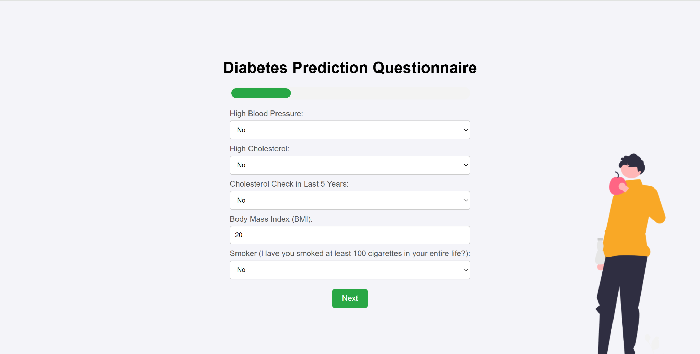
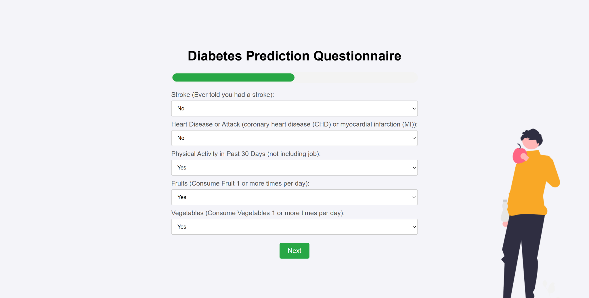
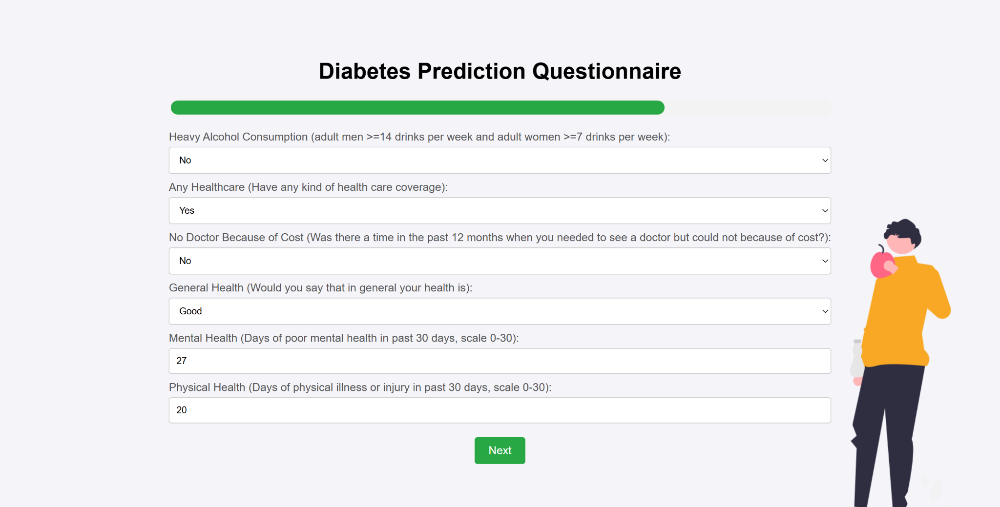
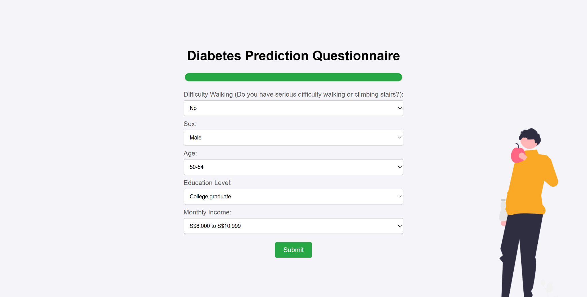
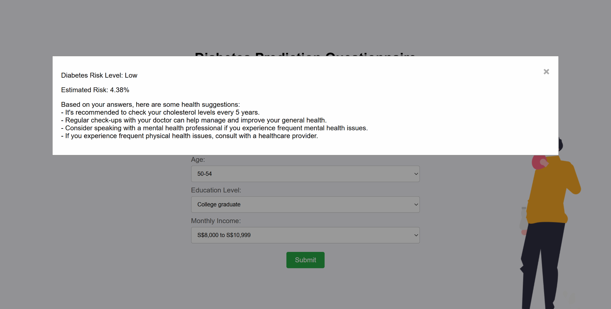

# Diabetes Risk Prediction Web App

This project is a web application that allows users to assess their risk of diabetes through a user-friendly online questionnaire. It utilizes a machine learning model (XGBoost) for prediction and is deployed using AWS Chalice.

## Features

- 🌐 Web-based questionnaire to collect health-related data
- 🧠 Machine Learning model (XGBoost) to predict diabetes risk
- 📊 Risk result displayed with health recommendations
- ⚙️ Backend deployed using AWS Chalice and Python
- 🖼️ Frontend designed with HTML/CSS and interactive elements

## Project Structure

```
Diabetes-Risk-Prediction/
├── .chalice/                  # Chalice configuration and routing (used for local/deploy modes)
├── Model/                     # Trained ML model artifacts
│   ├── xgb_model.pkl          # Trained XGBoost classifier
│   ├── scaler.pkl             # StandardScaler used for preprocessing
│   └── feature_order.json     # Ordered list of input features expected by the model
├── images/                    # Screenshots for documentation (used in README)
├── Site with images/          # Static frontend files (HTML, CSS, JS)
│   └── index.html             # Main UI for the multi-step questionnaire
├── app.py                     # Backend code using Chalice (handles prediction requests)
├── requirements.txt           # Python dependencies list
└── README.md                  # Project documentation

```

## How It Works

1. Users answer a series of questions across multiple steps.
2. Inputs are sent to the backend via a REST API.
3. The data is preprocessed and scaled using a saved `scaler.pkl`.
4. The pre-trained `xgb_model.pkl` predicts diabetes risk.
5. The result and personalized suggestions are shown in a modal.

## Example Screenshots

> Start Page  
> 

> Questionnaire Pages  
> 
> 
> 
> 

> Final Result Modal  
> 

## Setup Instructions

1. **Install dependencies**

```bash
pip install -r requirements.txt
```

2. **Deploy Chalice App**

```bash
chalice deploy
```
  or run in local environment
```bash
chalice local
```

3. **Run Frontend**
Open `Site with images/input.html` in a browser, or serve the static site using any HTTP server.

## Notes

- This app is for educational/demo purposes.
- The model is trained using health survey data and may not generalize to all populations.
- Always consult healthcare professionals for real diagnoses.

## License

MIT License.
